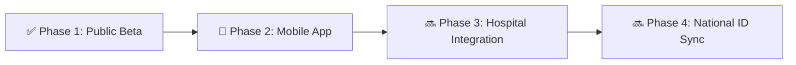

# 📱 MyHealth Mobile

> **A premium, minimalist Flutter health application bringing world-class healthcare tools to Naga City, Philippines.**


---

## ✨ What Makes MyHealth Special?

MyHealth isn't just another health app—it's a **life-saving companion** designed with emergency response in mind. Built with a stunning **Apple Health-inspired design**, every pixel is crafted to deliver critical health information when seconds matter most.

### 🎯 Core Philosophy
- **⚡ Offline-First** - Works without internet for emergency situations
- **🎨 Premium Minimalist** - Beautiful, distraction-free interface
- **🚨 Emergency-Focused** - Every feature designed for crisis situations
- **🔒 Privacy-First** - Your health data stays on YOUR device

---

## 🌟 Features That Save Lives

### 💓 **Heart Health Monitor**
Comprehensive CVD risk assessment calculator with:
- 11-factor medical questionnaire
- Real-time risk stratification (Low → Very High)
- Personalized action plans
- Color-coded visual results with circular indicators

### 🦟 **Dengue Radar** 
Live outbreak tracking with interactive maps:
- Real-time hotspot visualization on OpenStreetMap
- Pulsing animated markers (you can see them breathe!)
- Strict Naga City bounds to keep you focused
- Prevention tips accordion for community action
- One-tap emergency hotline calling

### 🚨 **F.A.S.T. Stroke Detection**
Award-winning stroke identification tool featuring:
- **Interactive symptom cards** - Tap to select Face, Arms, Speech issues
- **Persistent global timer** - Starts automatically when symptoms detected
- **Cross-screen timer toast** - Follows you everywhere (except stroke page)
- **Navigation warnings** - Prompts before leaving with active timer
- **Golden hour education** - Learn why 3-4.5 hours matters
- **Emergency FAB** - One tap to call 911

### 🏥 **Health Passport (LifeQR)**
Your life in a QR code:
- Emergency contact information
- Blood type & allergies
- Medical conditions & medications
- Persistent local storage (Privacy guaranteed!)
- Instant QR generation for first responders
- Edit/View mode toggle

### 📅 **Wellness Screening Catalog**
Free health screenings made accessible:
- Cervical cancer screening (21-65 years)
- Prostate health checks (40+ men)
- HIV/AIDS testing (All adults)
- Diabetes screening (At-risk populations)
- Detailed eligibility requirements
- Expandable service cards

### 🎯 **Emergency Identification Hub**
Four critical tools in one place:
1. **Stroke (Purple)** - F.A.S.T. brain emergency detection
2. **Heart Attack (Red)** - Cardiac emergency recognition + aspirin guidance
3. **Dengue Fever (Orange)** - Warning signs + medication warnings
4. **Child Emergency (Teal)** - Pediatric alerts with age-specific fever guides

---

## 🏗️ Architecture & Tech Stack

### **Framework & Core**
```yaml
Flutter: 3.x           # Cross-platform native performance
Dart: 3.x              # Type-safe, modern language
Material: 2.x          # Custom theme, Material 3 DISABLED
```

### **State Management**
```dart
Provider              # Reactive state management
├─ PassportProvider   # Health data + SharedPreferences
└─ StrokeTimerProvider # Global timer with cross-screen persistence
```

### **Navigation**
```dart
go_router: ^14.0.0    # Declarative routing with nested layouts
├─ ShellRoute         # Persistent bottom navigation
├─ context.go()       # Top-level navigation
└─ context.push()     # Nested routes
```

### **Key Dependencies**
| Package | Purpose | Why We Love It |
|---------|---------|----------------|
| `flutter_map` | OpenStreetMap integration | Free, offline-capable maps |
| `shared_preferences` | Local data persistence | Simple, reliable storage |
| `google_fonts` | Plus Jakarta Sans typography | Premium font family |
| `lucide_icons` | Beautiful icon set | 1000+ consistent icons |
| `qr_flutter` | QR code generation | Fast, customizable QR codes |
| `url_launcher` | Phone calls & external links | One-tap emergency calling |

---

## 🎨 Design System

### **Color Palette**
Our medically-inspired color scheme speaks the language of healthcare:

```dart
// Primary
Medical Blue    #0EA5E9  // Trust & professionalism
Off-White BG    #F8FAFC  // Calm & clean

// Emergency
Alert Red       #EF4444  // Heart attack, critical alerts
Stroke Purple   #8B5CF6  // Brain emergency indicator
Dengue Orange   #F97316  // Fever & infection warnings
Success Green   #22C55E  // Health achievements
Child Teal      #14B8A6  // Pediatric care
```

### **Typography**
```dart
Font Family: Plus Jakarta Sans
Weights: 400 (Regular), 500 (Medium), 600 (SemiBold), 700 (Bold), 800 (ExtraBold)

Hierarchy:
├─ Hero Headers:  40px, Weight 800
├─ Page Titles:   28px, Weight 800
├─ Card Headers:  20px, Weight 700
├─ Body Text:     16px, Weight 400
└─ Captions:      12px, Weight 500
```

### **UI Components**
- **🔮 Glassmorphism** - Floating bottom navigation dock with blur effects
- **🌊 Soft Shadows** - Layered depth without harshness
- **🎯 Large Touch Targets** - Emergency buttons are HUGE (minimum 64x64)
- **📏 Generous Whitespace** - 24px standard padding for breathing room

---

## 📁 Project Structure

```
lib/
├── 🎯 main.dart                      # App entry + custom theme
├── 🗺️  router.dart                    # GoRouter navigation config
│
├── 📊 providers/
│   ├── passport_provider.dart        # Health passport + persistence
│   └── stroke_timer_provider.dart    # Global timer state
│
├── 📱 screens/
│   ├── home_screen.dart             # Landing page with service grid
│   ├── cvd_screen.dart              # CVD risk calculator
│   ├── dengue_screen.dart           # Map + hotspots + prevention
│   ├── identify_hub_screen.dart     # Emergency tool selector
│   ├── stroke_screen.dart           # F.A.S.T. + timer + education
│   ├── heart_attack_screen.dart     # Cardiac emergency guide
│   ├── dengue_identify_screen.dart  # Dengue symptom checker
│   ├── child_emergency_screen.dart  # Pediatric alert system
│   ├── passport_screen.dart         # QR code + health data
│   ├── roadmap_screen.dart          # Project timeline
│   └── screening_screen.dart        # Wellness catalog
│
└── 🧩 widgets/
    ├── custom_scaffold.dart         # Nav dock + stroke toast
    ├── emergency_guide_screen.dart  # Reusable emergency template
    └── risk_result_sheet.dart       # CVD result bottom sheet
```

---

## 🚀 Quick Start

### **Prerequisites**
```bash
# Check versions
flutter --version   # Need 3.0+
dart --version      # Need 3.0+
```

### **Installation**
```bash
# 1. Clone & navigate
cd myhealth_mobile

# 2. Get dependencies
flutter pub get

# 3. Run on device
flutter run

# 4. Or build release APK
flutter build apk --release
```

### **Pro Tips**
- Use `flutter run -d chrome` for web preview (beta)
- Hot reload: Press `r` in terminal
- Hot restart: Press `R` in terminal
- Debug mode: Device toolbar with performance overlay

---

## 💡 State Management Deep Dive

### **PassportProvider**
Your health data guardian:

```dart
class PassportProvider extends ChangeNotifier {
  // Auto-saves to SharedPreferences after every change
  Future<void> updateBloodType(String type) async {
    _bloodType = type;
    await _save();
    notifyListeners();  // Triggers UI rebuild
  }
  
  // QR-ready data export
  String get qrData => jsonEncode({
    'name': fullName,
    'blood': bloodType,
    'allergies': allergies,
    // ... more fields
  });
}
```

### **StrokeTimerProvider**
The hero of emergency response:

```dart
class StrokeTimerProvider extends ChangeNotifier {
  Timer? _timer;
  int _seconds = 0;
  bool _isActive = false;
  
  void startTimer() {
    _isActive = true;
    _timer = Timer.periodic(Duration(seconds: 1), (_) {
      _seconds++;
      notifyListeners();  // Updates timer display AND floating toast
    });
  }
  
  String get formattedTime {
    final mins = (_seconds ~/ 60).toString().padLeft(2, '0');
    final secs = (_seconds % 60).toString().padLeft(2, '0');
    return '$mins:$secs';
  }
}
```

**Why this matters:** The stroke timer persists across ALL screens, showing a red floating toast everywhere except the stroke page itself. This ensures users never forget they have an active emergency in progress.

---

## 🎯 Feature Highlights

### **Dengue Map Constraints**
We use strict geographical bounds to keep users focused on Naga City:

```dart
MapOptions(
  initialCenter: LatLng(13.6218, 123.1948),  // Naga City center
  cameraConstraint: CameraConstraint.contain(
    bounds: LatLngBounds(
      LatLng(13.58, 123.15),  // Southwest bound
      LatLng(13.66, 123.25),  // Northeast bound
    ),
  ),
  minZoom: 13.0,
  maxZoom: 18.0,
)
```

### **Stroke Timer UX Flow**
1. User taps **Face** card → Timer starts
2. Navigate to home → **Red toast appears** at bottom
3. User sees "SYMPTOM ACTIVE: MM:SS"
4. Try to leave stroke page → **Warning dialog**
5. Call button **always visible** as FAB

---

## 🔧 Developer Notes

### **Theme Customization**
Material 3 is **intentionally disabled**. Our custom theme in `main.dart`:

```dart
ThemeData(
  useMaterial3: false,  // Critical!
  primaryColor: Color(0xFF0EA5E9),
  scaffoldBackgroundColor: Color(0xFFF8FAFC),
  fontFamily: 'PlusJakartaSans',
  // ... custom button styles, card themes, etc.
)
```

### **Navigation Gotchas**
- `ShellRoute` wraps all main routes for persistent nav dock
- Use `context.go('/route')` for same-level navigation
- Use `context.push('/route')` for drill-down navigation
- Stroke timer toast checks: `if (location != '/identify/stroke')`

### **Data Persistence**
Only `PassportProvider` persists data. `StrokeTimerProvider` is **in-memory only** by design (emergency timers should reset on app restart).

---

## 🗺️ Roadmap

Our journey to revolutionize healthcare in Naga City:



- ✅ **Phase 1: Public Beta** - MVP features (LIVE on web)
- 🔄 **Phase 2: Mobile App** - Flutter native app (YOU ARE HERE!)
- 🔜 **Phase 3: Hospital Data** - Real-time patient records
- 🔜 **Phase 4: PhilSys Integration** - National ID verification

---

## 📞 Emergency Contacts

| Service | Number | Availability |
|---------|--------|-------------|
| **Emergency Hotline** | 911 | 24/7 |
| **Dengue Hotline** | (054) 473-2326 | Office hours |
| **City Health Office** | (054) 473-2326 | 8AM - 5PM |

---

## 🤝 Contributing

Want to make healthcare more accessible? Here's how:

1. **Fork** the repository
2. **Create** a feature branch (`git checkout -b feature/AmazingFeature`)
3. **Commit** your changes (`git commit -m 'Add some AmazingFeature'`)
4. **Push** to the branch (`git push origin feature/AmazingFeature`)
5. **Open** a Pull Request

### **Code Style**
- Follow official [Flutter style guide](https://dart.dev/guides/language/effective-dart/style)
- Use `flutter format .` before committing
- Add comments for complex medical logic
- Write tests for critical health calculations

---

## 📄 License

This project is licensed under the **MIT License** - empowering healthcare innovation worldwide.

---

## 💖 Acknowledgments

**Built with ❤️ for Naga City**

- **Design Inspiration:** Apple Health, Notion
- **Icons:** Lucide Icons
- **Maps:** OpenStreetMap Contributors
- **Typography:** Plus Jakarta Sans by Tokotype
- **Community:** Flutter Philippines

---

## 📸 Screenshots

> *Coming soon - App screenshots showcasing the beautiful UI*

---

## 🎓 Learn More

- [Flutter Documentation](https://docs.flutter.dev/)
- [Provider Package](https://pub.dev/packages/provider)
- [Go Router Guide](https://pub.dev/packages/go_router)
- [Flutter Map Docs](https://docs.fleaflet.dev/)

---

<div align="center">

**MyHealth Mobile** | Making Healthcare Accessible

*Your health, connected. Your life, protected.*

[Report Bug](https://github.com/yourusername/myhealth/issues) · [Request Feature](https://github.com/yourusername/myhealth/issues) · [Documentation](#)

</div>
